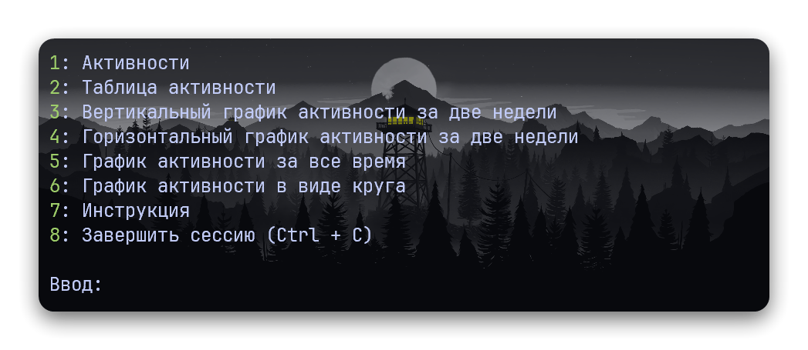
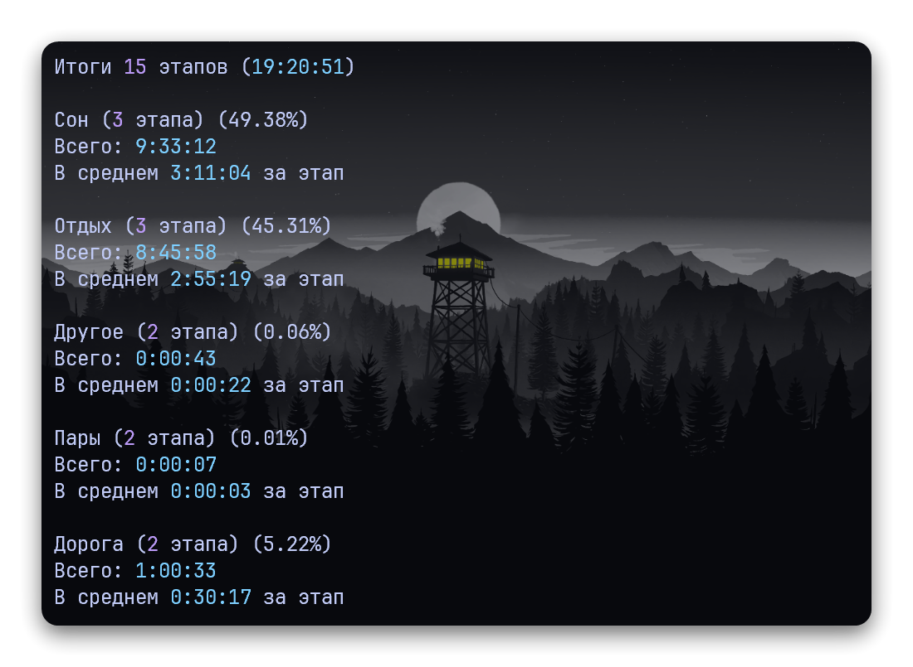

# Tracker: Настраиваемый трекер времени с аналитикой

Данный проект представляет собой настраиваемый трекер времени с возможностью анализа и визуализации собранных данных. Он позволяет отслеживать время, затраченное на различные задачи и активности, а также предоставляет инструменты для изучения этих данных с помощью графиков и диаграмм.

## Оглавление

- [Tracker: Настраиваемый трекер времени с аналитикой](#tracker-настраиваемый-трекер-времени-с-аналитикой)
  - [Оглавление](#оглавление)
  - [Установка](#установка)
  - [Использование](#использование)
    - [Основной скрипт](#основной-скрипт)
    - [Трекер времени](#трекер-времени)
    - [Файл сохранения](#файл-сохранения)
  - [Аналитика](#аналитика)
    - [Скрипты визуализации](#скрипты-визуализации)
  - [Сохранение графиков](#сохранение-графиков)
  - [Настройки](#настройки)

## Установка

Для работы с проектом требуется Python 3 и следующие библиотеки:

- `matplotlib` для работы с графиками
- `Pillow` и `numpy` для создания кружочка времени
- `tqdm` для отрисовки прогресс-бара
- `rich` для отрисовки таблицы активностей и инструкции

Эти библиотеки можно установить, выполнив следующую команду:

```shell
pip install -r requirements.txt
```

## Использование

### Основной скрипт

Основным скриптом является `main.py`. С его помощью можно запускать другие скрипты проекта.



### Трекер времени

Ключевым скриптом для отслеживания времени является `tracker.py`. Он обеспечивает интерактивное взаимодействие с пользователем, позволяя запускать и останавливать трекер, а также управлять списком активностей (занятий). Пользователь может добавлять, удалять и редактировать активности, изменять время их выполнения.


Управление трекером происходит вручную. После завершения одной активности сразу начинается другая (пустоты между ними нет). Формат активностей в сохранении сплошной, доступно также редактирование последней активности из трекера. Для изменения времени можно использовать секунды, минуты, часы и дни (`s`, `m`, `h`, `d`), формат записи и примеры валидных отрезков приведены ниже.

Валидные строки для изменения времени:
```
42        -> 42 секунды
m         -> одна минута
1.5h 32m  -> полтора часа и 32 минуты
16h -15m  -> 16 часов без 15 минут
w +6.25h  -> неделя и 6.25 часа (плюс опционален)
```


При удалении активности предыдущая занимает все ее время.

```
    До удаления               После
| этап 1 | этап 2 |  -> |     этап 1      |
```

### Файл сохранения

Данные об активностях и времени их выполнения сохраняются в файле `save.py`. Для каждой активности в файле содержатся следующие данные:

- Название активности
- Unix-time метка начала активности
- Читаемое представление метки времени
- Подпись (комментарий) к активности

```python
saved = True
timestamp = 1670744270.0
activities = [
    ["Отдых", 1670698800.0, "10.12.2022 22:00:00", "Начало"],
    ["Сон", 1670704503.0, "10.12.2022 23:35:03", ""],
    ["Отдых", 1670738442.0, "11.12.2022 09:00:42", ""],
    ["Другое", 1670740670.0, "11.12.2022 09:37:50", "Поход в горы"],
]
```

В скриптах используется `Unix-time` метка времени, а текстовое представление необходимо только для удобства поиска нужной даты при редактировании. Если вы хотите изменить данные в файле сохранения вручную, необходимо изменить `Unix-time` метку соответствующей активности. Для перевода времени из одного формата в другой можно использовать скрипт `timestamper.py`.

Раз в неделю (от первого этапа) трекер создает бэкап файла сохранения. Файлы бэкапов хранятся в папке `dumps`.

## Аналитика

При выходе из трекера он показывает простую аналитику по файлу сохранения.



### Скрипты визуализации

Для более наглядной визуализации собранных данных можно использовать следующие скрипты:

- `bar.py` и `barh.py` - отображают активности из файла сохранения по дням за последние две недели. Внизу присутствует отдельный график с процентным распределением активностей за все время.

  |  |  |
  |------------------------|--------------------------|

- `map.py` - отображает все активности из файла сохранения в виде стекированной диаграммы. Полезен для изучения больших файлов сохранения.

  

- `density.py` - отображает среднее время каждой активности по неделям или за все время (в накопительном виде).

  
  

- `circles.py` - создает кружок времени, где каждая точка представляет начало активности. Расстояние точки от центра зависит от недели.

  |  |  |
  |-----------------------------------|-----------------------------------|

## Сохранение графиков

Все сгенерированные графики сохраняются в виде PNG-изображений в папке `graph_images`. Имена файлов формируются по следующему шаблону: `{тип_графика}{дата}.{время}.png`
Где:

- `{тип_графика}` - название типа графика, например, `bar` или `barh`.
- `{дата}` - текущая дата в формате `ДД.ММ.ГГГГ`.
- `{время}` - текущее время в формате `ЧЧ_ММ` (часы и минуты, разделенные подчеркиванием).

Пример имени файла: `bar20.04.2024.15_14.png`

Это имя указывает, что файл содержит график типа `bar`, сгенерированный 20 апреля 2024 года в 15:14.

## Настройки

Все доступные настройки для скриптов находятся в файле `settings.toml`. Для каждого скрипта можно изменять определенные параметры из консоли при его запуске. Для того чтобы узнать доступные для изменения параметры, необходимо добавить флаг `--help`.


Список доступных этапов (активностей) для трекера определяется в секции `[activities]` файла настроек. Для каждой активности необходимо указать ее цвет в формате RGB для отображения на графиках.

```toml
[activities]
"Borderlands 2" = [255, 127, 14]
"Stone Story" = [128, 128, 128]
"Katana Zero" = [149, 103, 189]
"Hotline Miami 2" = [214, 39, 40]
"The Witness" = [42, 172, 251]
# "Название активности" = [r, g, b]  # цвет для matplotlib

"Пустота" = [0, 0, 0]
```

Порядок названий определяет порядок отображения активностей в списке среднего времени и на легенде.


Также можно создать и определить `VOID` этап. Этот этап не отображается на легенде и на графике. Для скриптов доступен флаг для исключения `Void` этапа. При этом флаге график среднего времени будет иметь лимит времени, исключающий `Void`:


Для правильной работы Void этап обязан быть последним в секции `[activities]` файла настроек, название этапа пустоты определяется значением поля `VOID` в секции `[global]`. Также, для возможности исключения `Void` этапа, он обязан присутствовать в файле сохранения.
